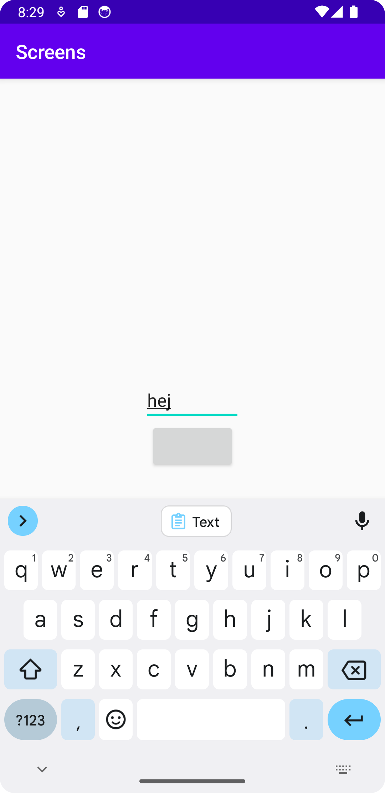
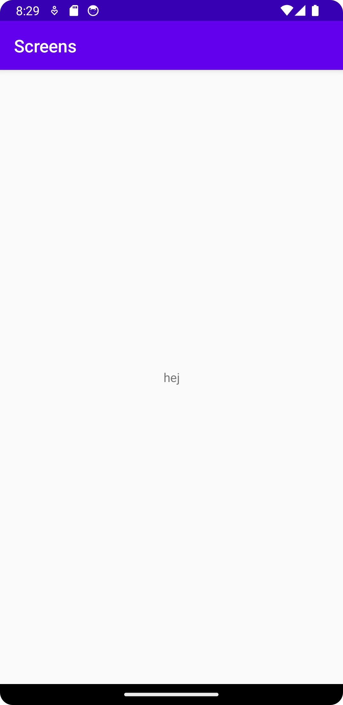

# Rapport
Inlämmningen började med att skapa en knapp i activity_main.xml och att identifiera den i MainActivity.  
Därefter lades en till activity vid namn SecondActivity till med tillhörande layoutfil.  
Efter det skapades en onClick till knappen med intents som gjorde att SecondActivity startades när knappen trycktes in.  
Sedan lades det till en EditText till MainActivities layoutfil med ett id. Den identiefieras sedan i knappens onClick och skickas vidare till SecondActivity med hjälp av extras.  
I SecondActivitys layout-fil skapades sedan en TextView med ett id. I onCreate av SecondActivity tar den där emot texten som var i EditText och skickar ut det till att vara i texten som är i TextViewen.  

# Kod
```
@Override
public void onClick(View view) {
    Log.d("==>", "Button clicked");
    Intent intent = new Intent(MainActivity.this, SecondActivity.class);
    EditText myNewEditText = (EditText) findViewById(R.id.editedText);
    intent.putExtra("carriedText", myNewEditText.getText().toString()); // Optional

    startActivity(intent);
}
```
Kod som beskriver vad som händer när knappen trycks in. Här skapar den en ny intent, skickar med data från en EditText view och sedan startar intenten.

# Bild på activity_main

# Bild på activity_second med medskickad data

